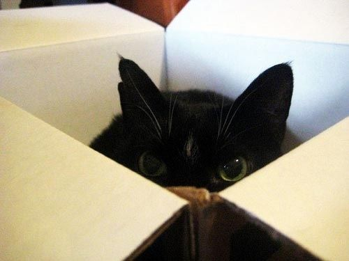
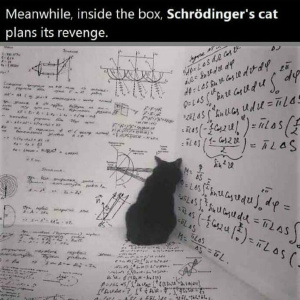

<h1>Quantaum Computing</h1>

Outline:

<ul>
<li>Schrödinger's cat
</li>
<li>Quantum computer
</li>
<li>Basic operations
</li>
<li>sumpy
</li>
</ul>

<h1>Schrödinger's cat</h1>
</ul>

<pre style="font-size:18px">
You probably heard before about the Schrödinger's cat, Schrödinger's cat is a thought experiment that asks a question, is the cat, which is inside the box, alive or dead?
Let's imagine you opened the box at time x-1, and you found the cat is alive, now you think that the cat is always alive,
but what if you opened the box at time x+1, and found that the cat is dead!!
know you know definitely that the car is alive at time x-1 and dead at time x+1, but what is her situation at time x?
In the thought experiment, a hypothetical cat may be considered simultaneously both alive and dead as a result of being linked to a random subatomic event that may or may not occur. 
</pre>

<h1>Quantum computer</h1>
<pre style="font-size:22px">
The experiment we view before is the main idea of the quantum computer.
In normal computers, which we use nowadays, and are also known as classical computers, the data, or the bit, is either 0 or 1, on or of, it cannot be both, that gives us one out of 2 to the power N possible permutations.
But by the quantum data, which is also known as a qubit, can be both 0 and 1 with All of 2 to the power N possible permutations.

</pre>

