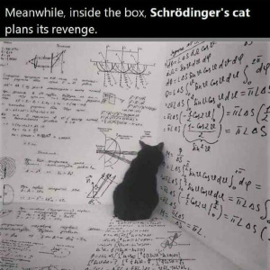
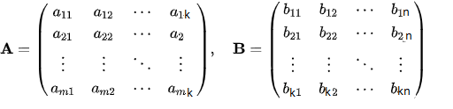
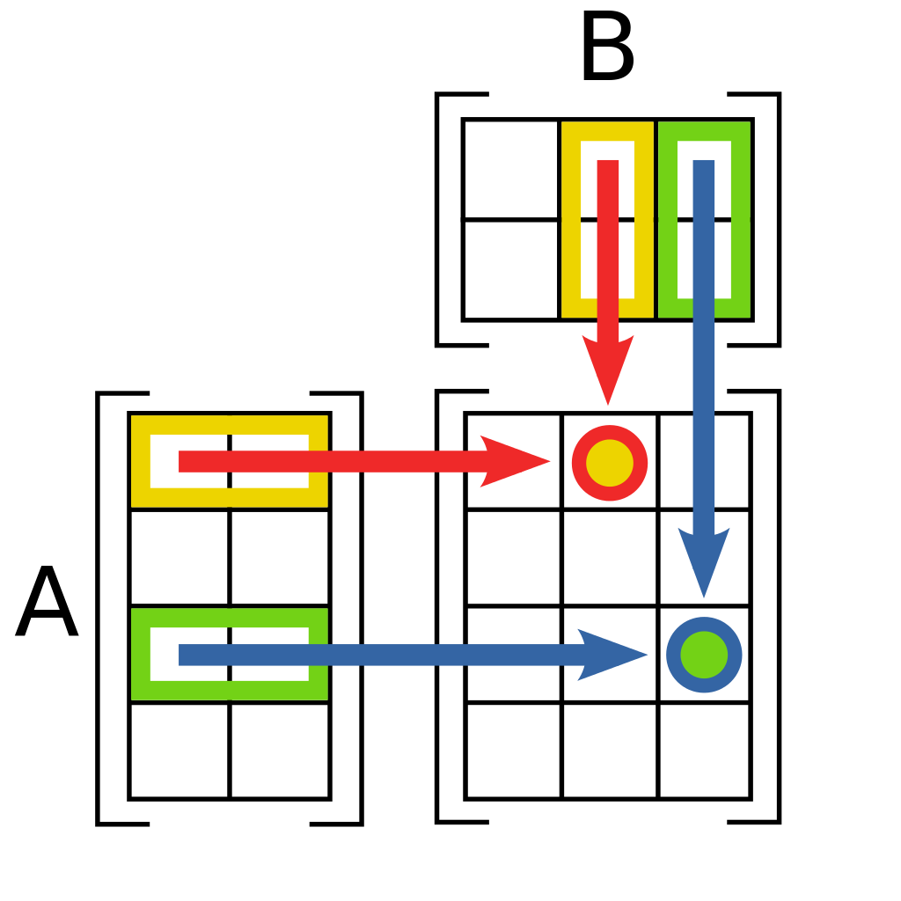
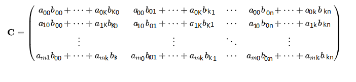

<h1>Quantaum Computing</h1>

Outline:

<ul>
<li>Schrödinger's cat
</li>
<li>Quantum computer
</li>
<li>Basic operations
</li>
</ul>

<h1>Schrödinger's cat</h1>
</ul>

<pre style="font-size:18px">
You probably heard before about the Schrödinger's cat, Schrödinger's cat is a thought experiment that asks a question, is the cat, which is inside the box, alive or dead?
Let's imagine you opened the box at time x-1, and you found the cat is alive, now you think that the cat is always alive,
but what if you opened the box at time x+1, and found that the cat is dead!!
know you know definitely that the car is alive at time x-1 and dead at time x+1, but what is her situation at time x?
In the thought experiment, a hypothetical cat may be considered simultaneously both alive and dead as a result of being linked to a random subatomic event that may or may not occur. 
</pre>

<h1>Quantum computer</h1>
<pre style="font-size:22px">
The experiment we view before is the main idea of the quantum computer.
In normal computers, which we use nowadays, and are also known as classical computers, the data, or the bit, is either 0 or 1, on or of, it cannot be both, that gives us one out of 2 to the power N possible permutations.
But by the quantum data, which is also known as a qubit, can be both 0 and 1 with All of 2 to the power N possible permutations.

</pre>

<h1>Basic operation</h1>
<pre>

Now we will see some linear algebra operation in classical computer and quantum computer:

<h1>Matrix multiplication</h1>

<h2 >Definition</h2>
<pre style="font-size:22px">In mathematics, particularly in linear algebra, matrix multiplication is a binary operation that produces a matrix from two matrices. 
For matrix multiplication, the number of columns in the first matrix must be equal to the number of rows in the second matrix. The resulting matrix, known as the matrix product, has the number of rows of the first and the number of columns of the second matrix. The product of matrices A and B is denoted as AB. 
From Wikipedia, the free encyclopedia
</pre> 

<h2>How can we do this?</h2>
<pre style="font-size:22px">Let's Define matrix A  with size: m X k ,and matrix B with size: k X n  

 
Then, as we saw in the definition, the number of columns in A is equal to the number of columns in B, then the multiplication, AB, can be done by the following approach:
 
We consider multiplying the rows of the first matrix with the opposite columns of the second matrix.
 

<h3>Steps: </h3>

We multiply the first element in the first row in the first matrix, A, with the first element of the first column in the second matrix, B, we also call this dot notation
, we still in the same row of A, and the same column of B, we add the previous multiplication to the second multiplication, the second multiplication is multiplying the second element in the first row in the first matrix, A, with the second element of the first column in the second matrix, until the end of the row and the column <small>-remember that the number of columns of the first matrix is equal to the number of rows of the second matrix-</small> then we move to the second row of A and the second column of B and apply the same approach till the end of the two matrics.

<!-- as a[0][1].b[1][0] -->

Well, This is alot of talking, let's write it in beutiful notations:

1- Let's consider the output matrix is C, we know that the first ever element:
in A: A[0][0], and in B: B[0][0],
we multiply them in put the answer in the first element in C:
C[0][0] = A[0][0].B[0][0]
2- The second element in the same row of A: a[0][1] and same column of B: b[1][0], 
as we still in the same row of A, we add this in the same element of C:
C[0][0] += A[0][1].B[1][0],

Do you get the equation? 

let's take another row of A:
3- Consider we moved to the second row of A [1][0], and the second column of B[0][1]:
remember the row of C is as the row of A, and the column of C is as B:
C[1][0] = A[0][1].B[0][0]

at the end C is looking like that:

Now we are ready to write the formal equation:

C[i][j]= A[i][0].B[0][j]+ A[i][1].B[1][j]+ ... +A[i][n].B[n][j]
</pre>

<pre>
<h1>Implement the outer product:</h1>
We Will see how to write the code in python:
<ul>
<li><pre>nested for loop 
With : O(n^3) 
</pre>
</li>
<li><pre>for i in range(len(matrixA)): # iterat through rows of A
            for j in range(len(matrixB[0])): # iterat through columns of B
                for k in range(len(matrixB)): #iterate through  raws of B
                    matrixC[i][j] += matrixA[i][k]*matrixB[k][j]</li>
    
 The main idea here is to iterate over the rows of the first matrix and the columns of the second matrix,then apply the function we produce before.

</pre>

 

</ul>

</pre>

<h2>Quantum computer</h2>
<pre style="font-size:22px">
as we did before in classical linear algebra, the multiplication is the same, but it differes in that we get the transpose of the second matrix, we will use the vectore|matrix notation
let's get the transpose of the matrix:
def trans(matrix):
    trans_matrix = [([0]*len(matrix)) for i in range(len(matrix[0]))]
    for i in range(len(matrix)):
        for j in range(len(matrix[0])):
            trans_matrix[j][i] = matrix[i][j]
    return trans_matrix
</pre>

</pre>
<footer>
  
See the article in<a href="https://dev.to/geehaad/quantum-computing-2a1h">dev</a>

</footer>
</body>
